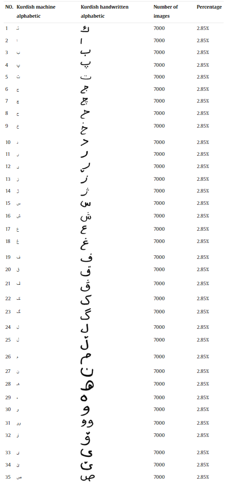
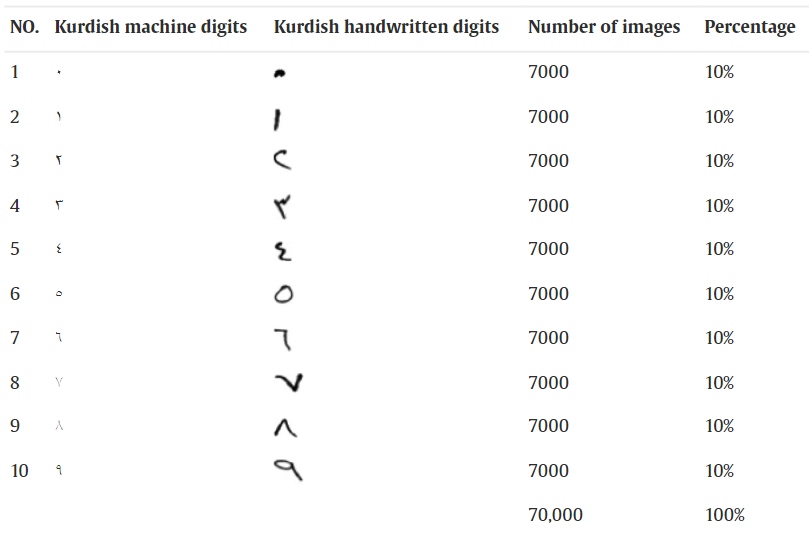

## Kurdish Central handwritten Character & Digit Recognition

This article presents two massive datasets for central Kurdish handwriting digits and isolated characters named K-ZHMARA and K-PIT. The first dataset, named K-ZHMARA dataset, contains 70,000 images of Kurdish digits, 7000 images for each digit, and a printed A4 paper with a grid of 10 × 10 is used for data collection. Apart from digits, the K-PIT dataset includes 245,000 images of all Kurdish characters, 7000 images for each character; data was collected via a printed A4 paper with a grid of 12 × 10 for this dataset. Moreover, both datasets include 315,000 images. Python programming has been used to scan each piece of paper, segment, crop, resize, binarize, and invert the images via edge detection and image processing techniques.

### **Fore More Information Visit My Paper In Data In Brief Journal Research [Here](https://www.sciencedirect.com/science/article/pii/S2352340923001324)**

## Objective

OCR aims to modify or convert any type of text or text-containing document, including handwritten, printed, or scanned text images, into a digital format that may be edited and used for more in-depth processing. OCR allows a machine to recognize text in such materials automatically. A few significant obstacles must be identified and overcome to automate successfully, for instance, the existence of a huge and reliable dataset.

There has not been much research done on automatically recognizing Kurdish handwritten characters and digits since machine and deep learning models need huge datasets to achieve high accuracy; the aim of this work is to prepare two huge datasets for the Kurdish language named K-PIT (for Kurdish characters) and K-ZHMARA (for Kurdish digits), these datasets can be used to build a model for handwriting optical character/digit recognition and identification via deep learning and machine learning approaches.

## Data Description

Kurdish language dialects are used across four main nation-states in the Middle East [2], and only one dialect, Sorani, has official status in one of these nation-states. The majority of Kurdish-speaking regions are located in Turkey, Iraq, Iran, and Syria. More than 40 million people speak Kurdish as a whole, according to estimates [3,4]. One of the two main dialects of Kurdish, known as Central Kurdish (Sorani), is spoken by an estimated 9 to 10 million people [5]. It is mostly written with a 35-character modified Arabic/Persian alphabet without characters that have recently been replaced, such as (ك), which is no longer used by the Kurdish language and has been replaced with (ک) [6,7]. A large database of isolated handwritten Central Kurdish digit and character images has been developed in this effort, totaling 315,000 images, with 7000 images of each handwritten by more than 1500 native individuals. Table 1 shows the number of images and the percentage of each character in the K-PIT database. The Quantity and Proportion of Digits Obtained for the K-ZHMARA Dataset are shown in Table 2. Central Kurdish uses modified Arabic/Persian (Farsi) characters for writing, and there are numerous expansive databases of Persian and Arabic handwriting characters for recognition of offline characters; some databases even assert that their database can be used to recognize other languages that use the Arabic scripts, for instance, Kurdish [8], [9], [10]. Nevertheless, there are three primary issues. The first is that it does not include all of the Kurdish letters, such as V(ڤ), L (ڵ), J(ژ), R(ڕ), and O (ۆ). The Kurdish language has an inconsistent quantity and percentage of characters, which is the second issue. The third problem is all the datasets worked with the characters only and ignored the digits.

* **Fore More Information Visit My Paper In Data In Brief Journal Research [Here](https://www.sciencedirect.com/science/article/pii/S2352340923001324)**
